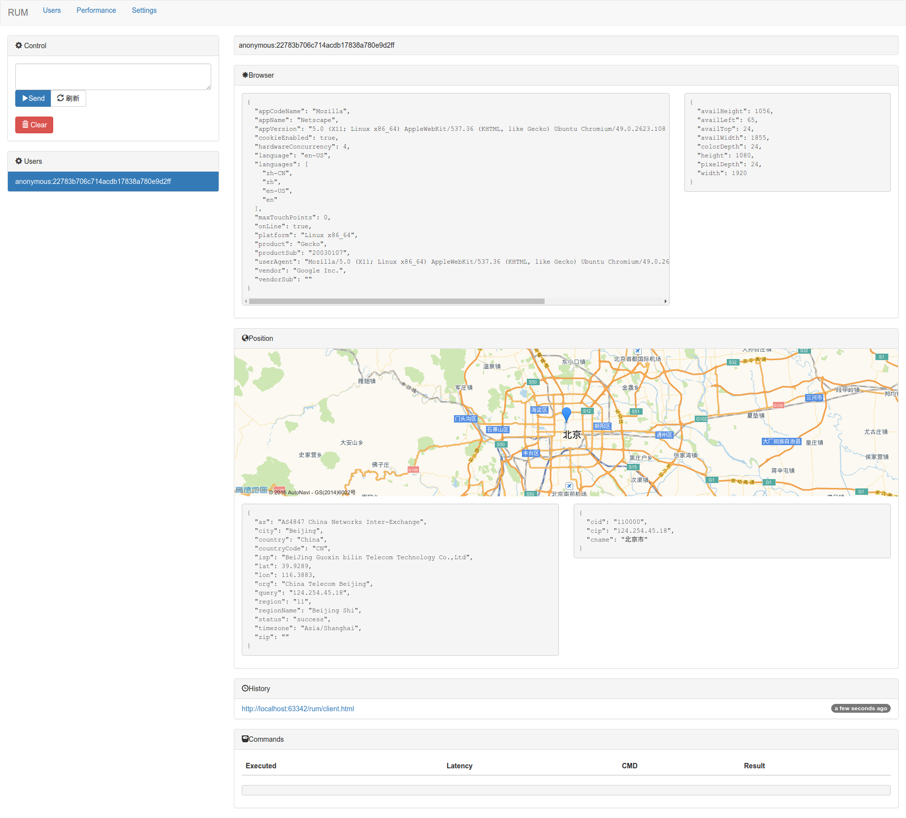
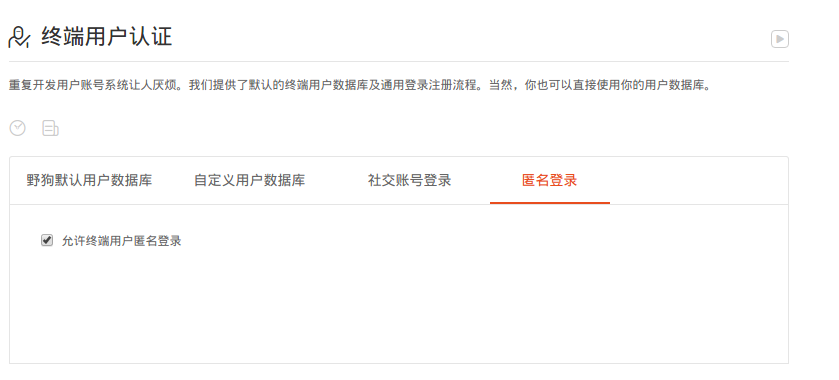

# rum
Realtime real user monitoring built on Wilddog BaaS




## Features

- [x] Realtime user list
- [x] Anonymous client
- [x] Show client position in map
- [x] Send JavaScript to all clients
- [x] Visit history
- [x] Performance.timing waterfall
- [x] Clear data


## Prerequisite

You need to register for following two services:

- `AMAP_KEY` from [AMAP](http://lbs.amap.com/)
- `WILDDOG_APP` from [Wilddog](https://www.wilddog.com/)

The anonymous loggin in wilddog must be turned on



## Usage

### Fork the code

```
git clone  git@github.com:wyvernnot/rum.git
cd rum
npm install
```

### Build the files for client and dashboard

```
AMAP_KEY=938bcc87bfbd6aaeff217efae48f450a WILDDOG_APP=https://rum.wilddogio.com webpack -p
```

### Host static files somewhere

### Include scripts

**Client**

```<script src="PATH/client.js"></script>```

**Dashboard**

```<script src="PATH/bundle.js"></script>```

## Reference

### How to get location via IP ?

**JSON**

- [ ] http://pv.sohu.com/cityjson?ie=utf-8
- [ ] http://int.dpool.sina.com.cn/iplookup/iplookup.php?format=js

**JSONP**

- [x] http://ip-api.com/json?callback=yourfunction

## LICENSE

GPL-3.0