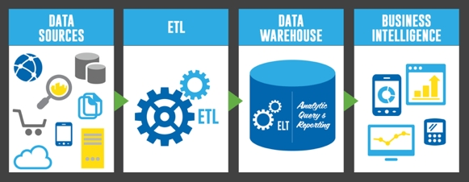
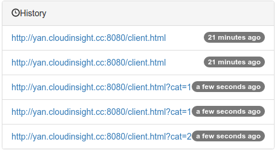
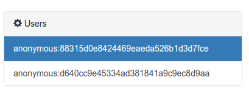
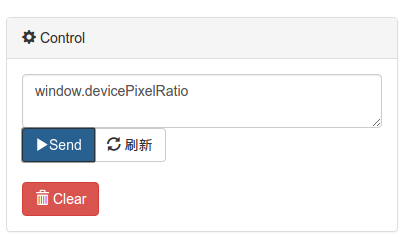
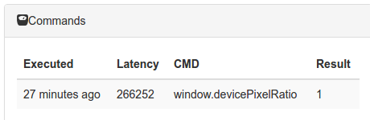
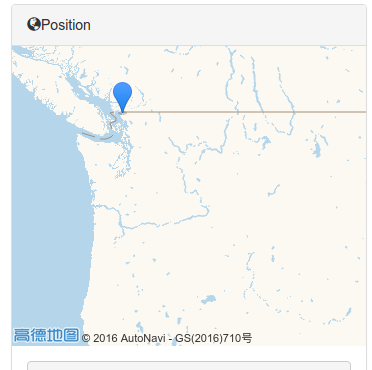
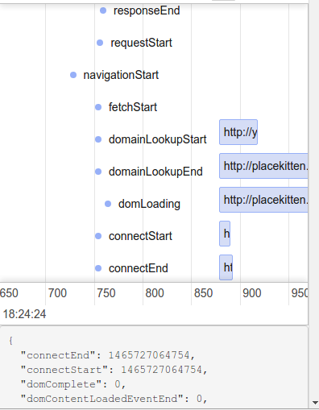

# rum
基于 `野狗` 开发一个真实用户体验收集程序。

真实用户体验是相对与模拟监控而言的，与模拟监控定期地主动去 **访问** 页面不同，
真实用户体验的收集是通过在应用程序里植入监控代码来实现的。
通过对用户体验的连续不断的监控，能够对网站和手机应用的运行状况做到心中有数。

关于真实用户体验收集，市面上已经很多成熟的方案，比如国内的 `OneAPM` 和听云，国外的 `NewRelic` 等。
但是这些方案的后端往往经过了清洗、统计和聚合等若干步骤，因此丢失了实时性和颗粒度。



`野狗`是实时后端云一个很好的方案，基于它能够开发即时聊天、实时游戏、实时定位等等在线应用。

如果把 `野狗` 的使用场景和真实用户体验收集的一些理念结合到一起，我们就能基于它 `DIY` 一个实时用户体验收集系统。

## 面向用户

为了把对用户的干扰加到最低，可以使用`野狗`的匿名登录功能，这么做主要是为了标识不同的浏览器。

通过这种方式相当于为每个用户在野狗的后端开辟了一小块存储的区域，后续的用户基本数据都存放在这一块区域里。

这个时候用户就不再是冷冰冰的统计数据，即不再是今天有多少用户使用了 Chrome 浏览器，而是这个 Chrome 爱好者
访问各个页面的历史是什么。



## 后端存储

先看看 `RUM` 需要采集哪些数据

- 浏览器信息
  - 厂商
  - 版本
  - 引擎
  - 语言
  - 尺寸
- 操作系统
  - CPU 架构
  - 版本
- 地理位置
- IP

`野狗` 可以作为后端存储的补充方案，也可以像这个项目一样**完全使用野狗做存储**。

通过使用 `ua-parser-js` 这个库配合其他一些命令，采集用户的基本数据，然后通过野狗的 `update API` 存到服务器上。

**浏览器信息**

```json
{
  "browser": {
    "major": "601",
    "name": "WebKit",
    "version": "601.1.46"
  },
  "device": {
    "model": "iPhone",
    "type": "mobile",
    "vendor": "Apple"
  },
  "engine": {
    "name": "WebKit",
    "version": "601.1.46"
  },
  "os": {
    "name": "iOS",
    "version": "9.3.2"
  }
}
```

**屏幕信息**

```json
{
  "availHeight": 548,
  "availLeft": 0,
  "availTop": 0,
  "availWidth": 320,
  "colorDepth": 32,
  "height": 568,
  "pixelDepth": 32,
  "width": 320
}
```

这就回答了用户来自哪里，用的什么上网设备的问题。

## 即时聊天

即时聊天程序都会有一个在线用户列表，从 `RUM` 角度来看，所有在线的用户都是监控的对象。



有一个问题是，前一个步骤的脚本不可能一次性把所有的数据都采集完，那么怎么才能动态的采集数据呢。

这就要借助即时聊天的思路，比如我们想知道所有设备的 `pixelRatio`，就对所有浏览器说

> 你去给我执行一下 `window.devicePixelRatio` 然后把结果告诉我

网页上的操作



点击 **Send**, 事先嵌入到网页里的监控程序就会上报机器的 `pixelRatio`，整个过程不需要用户的干预。



## 实时定位

要做到实时定位，其实只需要 `问` 对问题就行：

```
navigator.geolocation.getCurrentPosition(function(e){alert(JSON.stringify(e.coords))})
```

（好像暴露了什么）



## 应用性能

随着标准的渐渐流行，很多现代浏览器都已经提供了很好的接口获得性能数据。

```
performance.timing
```

```
performance.getEntries()
```

通过在客户端采集这些数据，并在服务器端通过可视化的方式展示，能够非常精确的看到应用加载的各个时间点。



## 已经实现的功能

- [x] 在线用户列表
- [x] 匿名统计
- [x] 在地图上显示客户端的位置
- [x] 把要执行的代码发送到所有的客户端
- [x] 记录浏览历史
- [x] 前端性能的瀑布图

## 开发

这个项目目前还属于概念验证的阶段。

[开发步骤](https://github.com/wyvernnot/rum/wiki/%E5%AE%89%E8%A3%85%E9%9C%80%E6%B1%82)

## LICENSE

GPL-3.0
