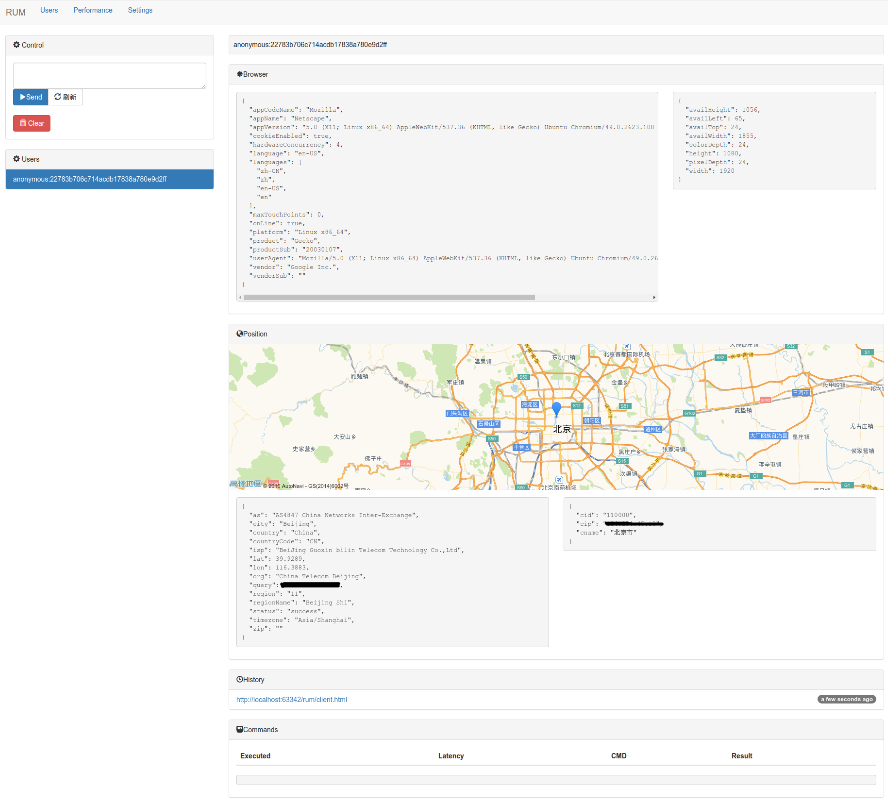
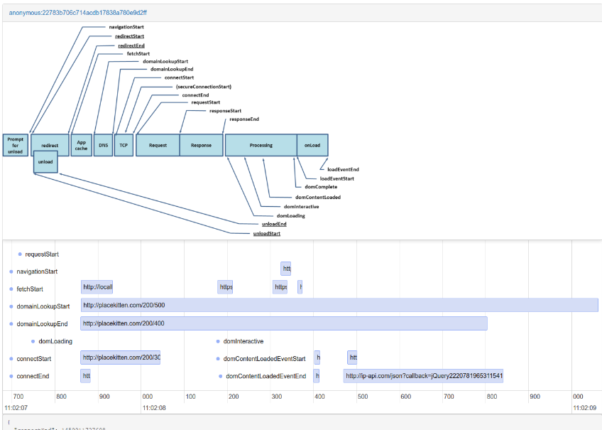

# rum
基于 `野狗` 开发一个真实用户体验收集程序。

## 功能

- [x] 在线用户列表
- [x] 匿名统计
- [x] 在地图上显示客户端的位置
- [x] 把要执行的代码发送到所有的客户端
- [x] 记录浏览历史
- [x] 前端性能的瀑布图

## 安装

[安装步骤](https://github.com/wyvernnot/rum/wiki/%E5%AE%89%E8%A3%85%E9%9C%80%E6%B1%82)

## LICENSE

GPL-3.0
